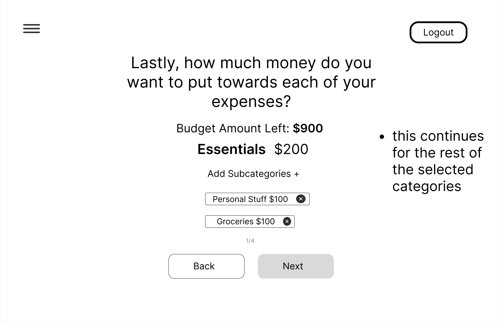
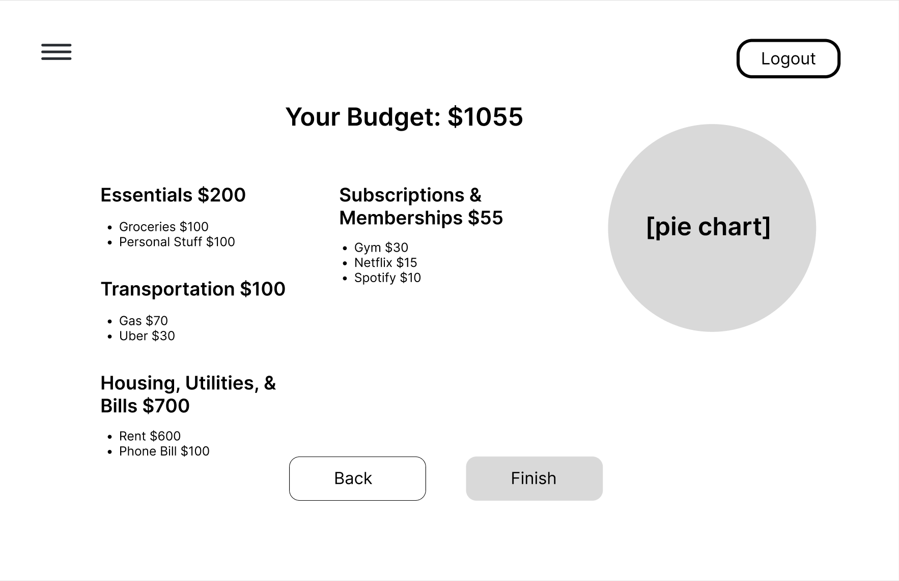
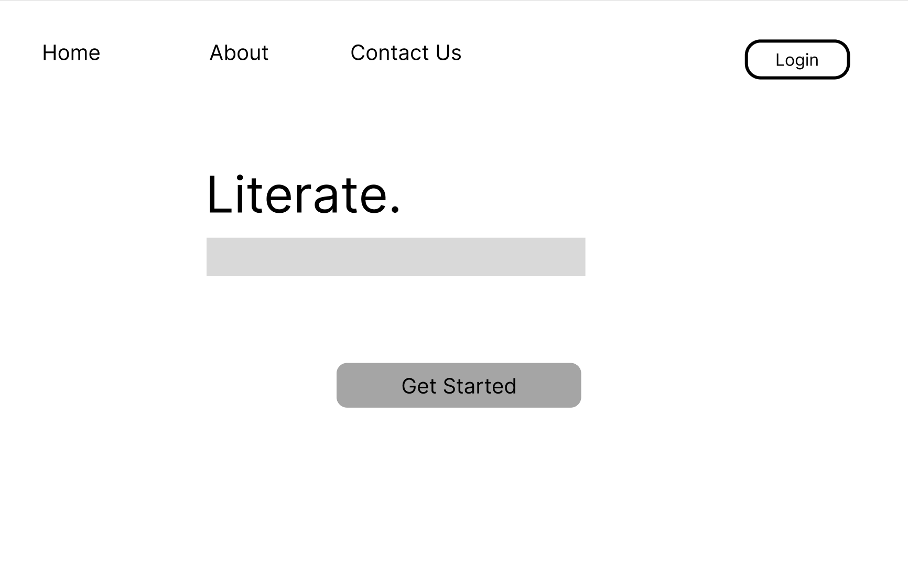
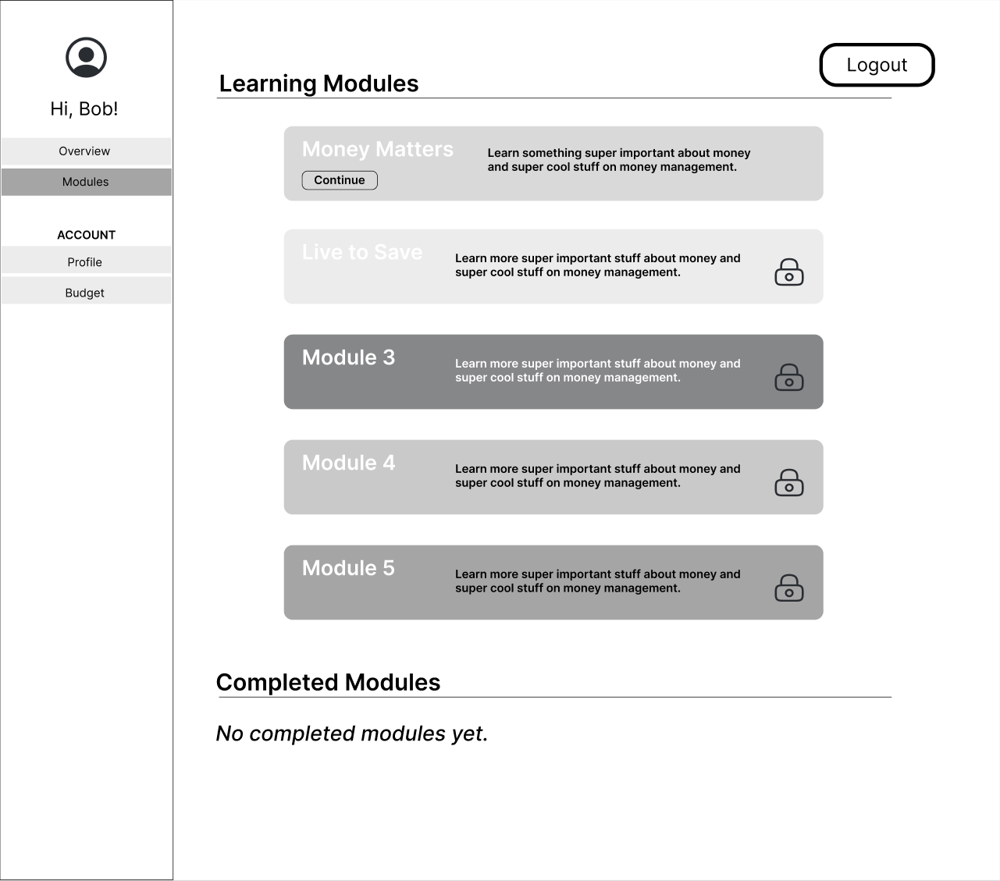

# Project Plan

Pod Members: **Jova, Sophia, Ayslin**

## Problem Statement and Description

College students often do not know the ins and outs of money management and how to budget their funds, our app is designed to to be used as both a learning tool as well as a personal tool to help college kids learn about the importance of managing their finances.

## User Roles and Personas

User Roles-

1. College Student
2. Financially inexperienced people

Personas-
Drake: age: 21 years old occupation: Unemployed marital status: In a relationship location: Florida spending habits:
Frugal with money
Struggles with keeping a job/ no steady income goal: Wants to buy a Car

Josh: age: 20 years old occupation: College student Works at campus store ($16/hr) marital status: Single spending habits:
Has little knowledge on business and budgeting
Likes to go out a lot (eating, shopping) goal: Wants to save to pay off student debt

## User Stories

1. As a 20 year old college student, I want to budget correctly, so that I can go out with friends.
2. As a 24 year old bank teller, I want to learn how to make smart financial decisions so that I can go on vacation.
3. As a California resident who's in college, I want to pay off my student debt so that I can live comfortably.
4. As an unemployed 22 year old, I want to learn how to save and budget so that I can eventually buy a car.
5. As a 21 year old in a relationship living in a 1 bedroom apt, I want to save money so that I can move to a bigger place.
6. As a 25 year old in a relationship, I want to be aware of my financial situation so I can be less frugal.
7. As a 28 year old pregnant, married woman, I want to learn how to save money so that I can buy a house.
8. As a 27 year old with financially dependent parents, I want to learn how to manage my money so that I can financially support them and myself.
9. As a 29 year old fast food manager, I want to make better financial decisions so that I can buy a house.
10. As a 26 year old software engineer living in New Jersey, I want to allocate money towards paying off my parents' debt.

## Pages/Screens

List all the pages and screens in the app. Include wireframes for at least 3 of them.

- Landing Page
- Registration Page
- Budgeting Page
- Learning Modules Page
- Profile Page

## Budgeting Page

## Landing Page

## Learning Module page

## Data Model

Describe your app's data model using diagrams or tables

## Endpoints

List the API endpoints you will need to implement.

**_Don't forget to set up your Issues, Milestones, and Project Board!_**
